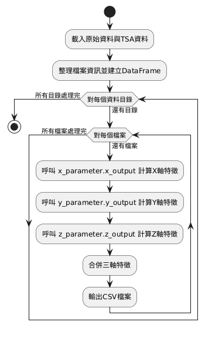

# Mechanical Fault Diagnosis Feature Extraction Analysis

This project is a Python-based tool for extracting features from vibration signals, suitable for mechanical fault diagnosis and condition monitoring. It can automatically batch process large amounts of triaxial sensor data, calculate time domain, frequency domain, wavelet, filtering, and Hilbert features, and consolidate the results for output.

---

## Project Structure

- `main_code.py`: Main control flow, responsible for data traversal, classification, feature calculation, and result output.
- `x_parameter.py`, `y_parameter.py`, `z_parameter.py`: Responsible for extracting features from the X/Y/Z axes, respectively.
- `timedomain.py`: Time domain feature calculation.
- `frequencydomain.py`: Frequency domain feature calculation and FFT processing.
- `harmonic_sildband_table.py`: Harmonic and sideband energy analysis.
- `filterprocess.py`: Filtering and higher-order statistical feature calculation.
- `waveletprocess.py`: STFT, CWT, and other wavelet feature calculations.
- `hilbertransfer.py`: Hilbert transform and envelope features.
- `initialization.py`: Centralized parameter management.
- `timefrequency.py`: Time-frequency analysis (reserved).

---

## Workflow

1. **Data Loading and Classification**  
   [`main_code.py`](main_code.py) traverses the specified root directory, organizes raw and TSA signal files, and builds the corresponding DataFrame structure.

2. **Feature Extraction**  
   For each data directory, sequentially calls:
   - [`x_parameter.x_output`](x_parameter.py)
   - [`y_parameter.y_output`](y_parameter.py)
   - [`z_parameter.z_output`](z_parameter.py)  
   to calculate features for each axis.

3. **Feature Calculation Modules**  
   Each axis feature calculation calls the following modules:
   - [`TimeDomain`](timedomain.py): Time domain features (peak, avg, rms, kurt, cf, eo)
   - [`FrequencyDomain`](frequencydomain.py): Frequency domain features (FFT, FM0, TSA FM0)
   - [`WaveLetProcess`](waveletprocess.py): Wavelet features (STFT, CWT, NP4)
   - [`FilterProcess`](filterprocess.py): Filtering and higher-order statistics (NA4, FM4, M6A, M8A, ER)
   - [`HilberTransfer`](hilbertransfer.py): Hilbert features (NB4, envelope)
   - [`HarmonicSildband`](harmonic_sildband_table.py): Harmonic and sideband energy

4. **Result Consolidation and Output**  
   Combine features from all three axes and output as a CSV file.

---

## UML Activity Diagram



---

## Main Dependencies

- pandas
- numpy
- scipy
- pywt

---

## Usage

1. Place your raw data in the folder specified by `root_inputdir` in `main_code.py`.
2. Run `main_code.py`:
   ```sh
   python main_code.py
   ```
3. The results will be output to the `excel` subdirectory.

---

## Contact

If you have any questions, please contact the project maintainer.

---

## Author

Lin Hung Chuan